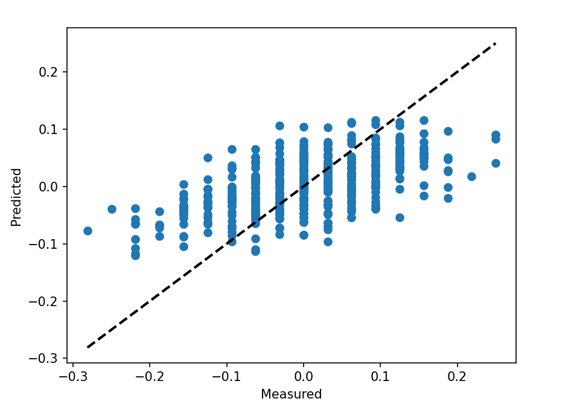

# Evaluating a Use of a Transformer Machine Learning Models for Predicting Resting Heart using timeseries dataset.

The code in this notebook reads in historical data on resting heart rate, cleans it, pre-processes it, and trains a neural network model to predict future resting heart rates.

The first few lines of the code import several Python libraries including pandas for data manipulation, datetime for working with dates, numpy for numerical operations, and scipy and sklearn for machine learning. The tensorflow library is also imported, which provides the Keras API for building neural networks. The matplotlib library is imported to visualize the results.

The code then loads in a CSV file using the pandas library and drops any rows with missing data. The script keeps only the calendar_date and wellness_resting_heart_rate columns of the data and sorts the data by date.

The to_sequences function then takes in the preprocessed data and splits the data into input sequences and target values, with the size of the input sequence given by SEQUENCE_SIZE. The input data is reshaped to have the shape (num_samples, sequence_length, 1), where num_samples is the number of input/output pairs and sequence_length is the length of each input sequence.

The build_model function creates a neural network model with a transformer encoder, a global average pooling layer, and an MLP head with one output unit. The model is compiled with mean squared error loss and Adam optimizer.

The model is trained with the fit function, which returns predictions for the test set. The performance of the model is then evaluated using several metrics including root mean squared error (RMSE), mean absolute percentage error (MAPE), and correlation coefficient.

Finally, the predicted and actual values of the test set are plotted as a scatter plot and line plot.

*Scatter Plot Measured vs Predicted:*

*Line Plot Measured vs Predicted:*

Resources:
* https://keras.io/examples/timeseries/timeseries_transformer_classification/
* https://github.com/keras-team/keras-io/blob/master/examples/timeseries/timeseries_classification_transformer.py
